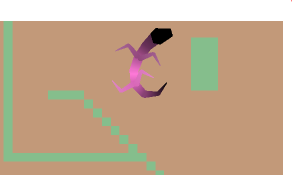
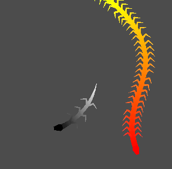

# Project Title

Name: Dmytro Kosynskyy

Student Number: C21376161

Class Group: TU858

# Description
Simulation of critters using procedural kinematics simulation

## Video:

[](https://www.youtube.com/watch?v=J2kHSSFA4NU)

## Screenshots






# Instructions

This is a showcase of inverse kinematics and how it can be used to create reptiles, insects and other animals
There is a tilemap which can be used to edit the simulation space and a couple of preplaced "Animals"

# How it works


# List of classes/assets

| Class/asset | Source |
|-----------|-----------|
| head.gd | Self written |
| Player.gd | Self written |
| snake_body.gd | Self written |
| snake_head.gd | Self written |

| Hana Caraka tileset | gotten from [hyperlink](https://otterisk.itch.io/hana-caraka-farming-foraging) |


# References
* Procedural Snake [hyperlink](https://www.youtube.com/watch?v=T73lvhhw_rA)
* Kinematics https://www.youtube.com/watch?v=hbgDqyy8bIw
* Kinematics https://www.youtube.com/watch?v=RTc6i-7N3ms


# Leg Kinematic solver

```gd
func leg_joint_update(source:Vector2, destination:Vector2, leg_index:int, leg_joint:Array, side:int):
	leg_joint[leg_index].set_point_position(0, source)
	
	# move the end point 
	var last_index = leg_joint[leg_index].get_point_count() - 1
	var current_end = leg_joint[leg_index].get_point_position(last_index)
	var new_end = current_end + (destination - current_end) * inter_rate
	leg_joint[leg_index].set_point_position(last_index, new_end)
	
	# move the points back
	for i in range(last_index - 1, 0, -1):
		var next_pos = leg_joint[leg_index].get_point_position(i + 1)
		var dir = (leg_joint[leg_index].get_point_position(i) - next_pos).normalized()
		leg_joint[leg_index].set_point_position(i, next_pos + dir * segment_length)
	
	for i in range(1, leg_joint[leg_index].get_point_count()):
		var prev = leg_joint[leg_index].get_point_position(i - 1)
		var dir = (leg_joint[leg_index].get_point_position(i) - prev).normalized()
		leg_joint[leg_index].set_point_position(i, prev + dir * segment_length)
	pass
```

# body Kinematic solver
```gd
var target_pos = get_point_position(0) + (target.global_position - get_point_position(0)) * inter_rate
	
	set_point_position(0, target_pos)
	

	for i in range(1, get_point_count()):
		var cur_pos = get_point_position(i)
		var prev_pos = get_point_position(i - 1)
		var to_cur = cur_pos - prev_pos

		# Normalize direction and clamp distance
		var direction = to_cur.normalized()
		target_pos = prev_pos + direction * segment_length

		# Angle limiting
		if i > 1:
			var base_dir = (get_point_position(i - 1) - get_point_position(i - 2)).normalized()
			var angle = base_dir.angle_to(direction)
			var max_angle = deg_to_rad(max_angle_degrees)

			if abs(angle) > max_angle:
				direction = base_dir.rotated(clamp(angle, -max_angle, max_angle))

		set_point_position(i, prev_pos + direction * segment_length)
```

# video demo

[](https://www.youtube.com/watch?v=J2kHSSFA4NU)

