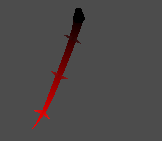

# Project Title

Name: Dmytro Kosynskyy

Student Number: C21376161

Class Group: TU858

# Description
Simulation of critters using procedural kinematics simulation

## Video:

[](https://www.youtube.com/watch?v=J2kHSSFA4NU)

## Screenshots




# Instructions

This is a showcase of inverse kinematics and how it can be used to create reptiles, insects and other animals
There is a tilemap which can be used to edit the simulation space and a couple of preplaced "Animals"

# How it works


# List of classes/assets

| Class/asset | Source |
|-----------|-----------|
| head.gd | Self written |
| Player.gd | Self written |
| snake_body.gd | Self written |
| snake_head.gd | Self written |

| Hana Caraka tileset | gotten from [hyperlink](https://otterisk.itch.io/hana-caraka-farming-foraging) |


# References
* Procedural Snake [hyperlink](https://www.youtube.com/watch?v=T73lvhhw_rA)
* Kinematics https://www.youtube.com/watch?v=hbgDqyy8bIw
* Kinematics https://www.youtube.com/watch?v=RTc6i-7N3ms


# From here on, are examples of how to different things in Markdown. You can delete.  

## This is how to markdown text:

This is *emphasis*

This is a bulleted list

- Item
- Item

This is a numbered list

1. Item
1. Item

This is a [hyperlink](http://bryanduggan.org)

# Headings
## Headings
#### Headings
##### Headings

This is code:

```Java
public void render()
{
	ui.noFill();
	ui.stroke(255);
	ui.rect(x, y, width, height);
	ui.textAlign(PApplet.CENTER, PApplet.CENTER);
	ui.text(text, x + width * 0.5f, y + height * 0.5f);
}
```

So is this without specifying the language:

```
public void render()
{
	ui.noFill();
	ui.stroke(255);
	ui.rect(x, y, width, height);
	ui.textAlign(PApplet.CENTER, PApplet.CENTER);
	ui.text(text, x + width * 0.5f, y + height * 0.5f);
}
```

This is an image using a relative URL:


This is an image using an absolute URL:


This is a youtube video:

[](https://www.youtube.com/watch?v=J2kHSSFA4NU)

This is a table:

| Heading 1 | Heading 2 |
|-----------|-----------|
|Some stuff | Some more stuff in this column |
|Some stuff | Some more stuff in this column |
|Some stuff | Some more stuff in this column |
|Some stuff | Some more stuff in this column |

